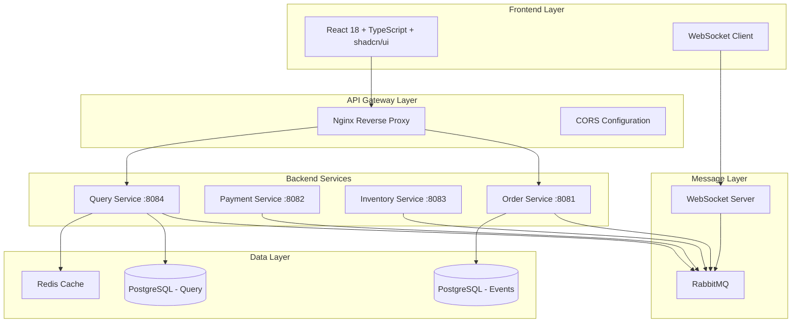
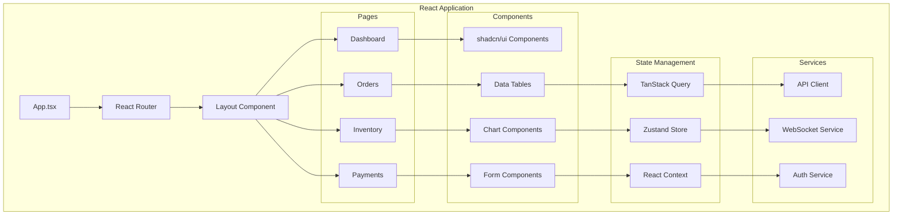

# Design Document

## Overview

This design document outlines the complete development and enhancement of a distributed order management system. The solution encompasses both backend corrections/improvements and a modern React frontend implementation. The system demonstrates advanced microservices patterns including Event Sourcing, CQRS, and event-driven architecture, with a focus on reliability, scalability, and user experience.

## Architecture

### High-Level System Architecture



### Frontend Architecture



## Components and Interfaces

### Backend Service Corrections

#### 1. Order Service Enhancements

**Configuration Improvements:**
- Fix database connection pooling with HikariCP
- Implement proper transaction management
- Add comprehensive health checks
- Configure resilience patterns (Circuit Breaker, Retry, Timeout)

**Error Handling:**
- Global exception handler with @ControllerAdvice
- Custom exception classes for business logic
- Proper HTTP status code mapping
- Correlation ID propagation for tracing

**Event Sourcing Fixes:**
- Ensure proper event serialization/deserialization
- Implement event versioning strategy
- Add event replay capabilities
- Fix aggregate root reconstruction

#### 2. Payment Service Corrections

**Message Processing:**
- Fix RabbitMQ consumer configuration
- Implement proper message acknowledgment
- Add dead letter queue handling
- Ensure idempotent message processing

**Resilience Patterns:**
- Circuit breaker for external payment gateway calls
- Exponential backoff retry mechanism
- Timeout configuration for long-running operations

#### 3. Inventory Service Improvements

**Data Consistency:**
- Implement proper locking mechanisms
- Add inventory reservation logic
- Ensure atomic operations for stock updates
- Add compensation logic for failed transactions

#### 4. Query Service Enhancements

**Read Model Optimization:**
- Implement efficient event projection
- Add database indexing strategy
- Implement caching layer with Redis
- Optimize query performance

### Frontend Components Architecture

#### 1. Core UI Components (shadcn/ui)

**Base Components:**
```typescript
// Component structure using shadcn/ui
interface ComponentStructure {
  ui: {
    button: ButtonComponent;
    card: CardComponent;
    table: TableComponent;
    dialog: DialogComponent;
    form: FormComponent;
    toast: ToastComponent;
    badge: BadgeComponent;
    tabs: TabsComponent;
    sheet: SheetComponent;
    dropdown: DropdownComponent;
    pagination: PaginationComponent;
    progress: ProgressComponent;
    skeleton: SkeletonComponent;
    separator: SeparatorComponent;
    scrollArea: ScrollAreaComponent;
    chart: ChartComponent;
  };
}
```

**Custom Components:**
```typescript
// Order-specific components
interface OrderComponents {
  OrdersTable: React.FC<{ orders: Order[] }>;
  CreateOrderDialog: React.FC<{ onOrderCreated: (order: Order) => void }>;
  OrderDetails: React.FC<{ orderId: string }>;
  OrderTimeline: React.FC<{ events: OrderEvent[] }>;
  OrderStatusBadge: React.FC<{ status: OrderStatus }>;
}

// Dashboard components
interface DashboardComponents {
  MetricCards: React.FC<{ metrics: DashboardMetrics }>;
  OrdersChart: React.FC<{ data: ChartData[] }>;
  StatusPieChart: React.FC<{ statusData: StatusData[] }>;
  RevenueChart: React.FC<{ revenueData: RevenueData[] }>;
}
```

#### 2. State Management Strategy

**TanStack Query for Server State:**
```typescript
// Query configuration
const queryClient = new QueryClient({
  defaultOptions: {
    queries: {
      staleTime: 5 * 60 * 1000, // 5 minutes
      cacheTime: 10 * 60 * 1000, // 10 minutes
      retry: 3,
      refetchOnWindowFocus: false,
    },
  },
});

// Query hooks
interface QueryHooks {
  useOrders: (filters?: OrderFilters) => UseQueryResult<Order[]>;
  useOrder: (orderId: string) => UseQueryResult<Order>;
  useInventory: () => UseQueryResult<InventoryItem[]>;
  usePayments: (filters?: PaymentFilters) => UseQueryResult<Payment[]>;
  useDashboardMetrics: () => UseQueryResult<DashboardMetrics>;
}
```

**Zustand for Client State:**
```typescript
// Global state store
interface AppStore {
  // UI state
  theme: 'light' | 'dark';
  sidebarOpen: boolean;
  
  // User state
  user: User | null;
  isAuthenticated: boolean;
  
  // Real-time state
  notifications: Notification[];
  connectionStatus: 'connected' | 'disconnected' | 'reconnecting';
  
  // Actions
  setTheme: (theme: 'light' | 'dark') => void;
  toggleSidebar: () => void;
  addNotification: (notification: Notification) => void;
  removeNotification: (id: string) => void;
  setConnectionStatus: (status: ConnectionStatus) => void;
}
```

#### 3. Real-time Communication

**WebSocket Integration:**
```typescript
// WebSocket service
class WebSocketService {
  private ws: WebSocket | null = null;
  private reconnectAttempts = 0;
  private maxReconnectAttempts = 5;
  
  connect(): void;
  disconnect(): void;
  subscribe(eventType: string, callback: (data: any) => void): void;
  unsubscribe(eventType: string): void;
  private handleMessage(event: MessageEvent): void;
  private handleReconnect(): void;
}

// Event types
interface WebSocketEvents {
  ORDER_CREATED: OrderCreatedEvent;
  ORDER_UPDATED: OrderUpdatedEvent;
  PAYMENT_PROCESSED: PaymentProcessedEvent;
  INVENTORY_UPDATED: InventoryUpdatedEvent;
  SYSTEM_NOTIFICATION: SystemNotificationEvent;
}
```

## Data Models

### Backend Data Models

#### Event Store Schema
```sql
-- Enhanced event store with better indexing
CREATE TABLE order_events (
    id BIGSERIAL PRIMARY KEY,
    aggregate_id VARCHAR(255) NOT NULL,
    event_type VARCHAR(255) NOT NULL,
    event_data JSONB NOT NULL,
    version INTEGER NOT NULL,
    timestamp TIMESTAMP DEFAULT CURRENT_TIMESTAMP,
    correlation_id VARCHAR(255),
    causation_id VARCHAR(255),
    user_id VARCHAR(255),
    
    UNIQUE(aggregate_id, version)
);

-- Optimized indexes
CREATE INDEX CONCURRENTLY idx_order_events_aggregate_id ON order_events(aggregate_id);
CREATE INDEX CONCURRENTLY idx_order_events_timestamp ON order_events(timestamp DESC);
CREATE INDEX CONCURRENTLY idx_order_events_type ON order_events(event_type);
CREATE INDEX CONCURRENTLY idx_order_events_correlation ON order_events(correlation_id);
```

#### Read Model Schema
```sql
-- Optimized read models
CREATE TABLE order_read_model (
    order_id VARCHAR(255) PRIMARY KEY,
    customer_id VARCHAR(255) NOT NULL,
    status VARCHAR(50) NOT NULL,
    total_amount DECIMAL(10,2) NOT NULL,
    created_at TIMESTAMP NOT NULL,
    updated_at TIMESTAMP NOT NULL,
    payment_status VARCHAR(50),
    inventory_status VARCHAR(50)
);

-- Performance indexes
CREATE INDEX idx_order_customer ON order_read_model(customer_id);
CREATE INDEX idx_order_status ON order_read_model(status);
CREATE INDEX idx_order_created ON order_read_model(created_at DESC);
CREATE INDEX idx_order_updated ON order_read_model(updated_at DESC);
```

### Frontend Data Models

#### TypeScript Interfaces
```typescript
// Core domain models
interface Order {
  id: string;
  customerId: string;
  status: OrderStatus;
  items: OrderItem[];
  totalAmount: number;
  createdAt: string;
  updatedAt: string;
  paymentStatus?: PaymentStatus;
  inventoryStatus?: InventoryStatus;
}

interface OrderItem {
  id: string;
  productId: string;
  productName: string;
  quantity: number;
  price: number;
  subtotal: number;
}

interface InventoryItem {
  productId: string;
  productName: string;
  availableQuantity: number;
  reservedQuantity: number;
  totalQuantity: number;
  lastUpdated: string;
}

interface Payment {
  id: string;
  orderId: string;
  amount: number;
  status: PaymentStatus;
  method: PaymentMethod;
  processedAt?: string;
  failureReason?: string;
}

// Dashboard metrics
interface DashboardMetrics {
  totalOrders: number;
  totalRevenue: number;
  conversionRate: number;
  pendingOrders: number;
  dailyOrders: ChartDataPoint[];
  ordersByStatus: StatusDistribution[];
  revenueByDay: RevenueDataPoint[];
}
```

## Error Handling

### Backend Error Handling Strategy

#### Global Exception Handler
```java
@ControllerAdvice
public class GlobalExceptionHandler {
    
    @ExceptionHandler(ValidationException.class)
    public ResponseEntity<ErrorResponse> handleValidation(ValidationException ex) {
        return ResponseEntity.badRequest()
            .body(new ErrorResponse("VALIDATION_ERROR", ex.getMessage()));
    }
    
    @ExceptionHandler(BusinessException.class)
    public ResponseEntity<ErrorResponse> handleBusiness(BusinessException ex) {
        return ResponseEntity.unprocessableEntity()
            .body(new ErrorResponse("BUSINESS_ERROR", ex.getMessage()));
    }
    
    @ExceptionHandler(ResourceNotFoundException.class)
    public ResponseEntity<ErrorResponse> handleNotFound(ResourceNotFoundException ex) {
        return ResponseEntity.notFound().build();
    }
    
    @ExceptionHandler(Exception.class)
    public ResponseEntity<ErrorResponse> handleGeneral(Exception ex) {
        log.error("Unexpected error", ex);
        return ResponseEntity.internalServerError()
            .body(new ErrorResponse("INTERNAL_ERROR", "An unexpected error occurred"));
    }
}
```

#### Circuit Breaker Configuration
```yaml
resilience4j:
  circuitbreaker:
    instances:
      payment-service:
        slidingWindowSize: 10
        minimumNumberOfCalls: 5
        failureRateThreshold: 50
        waitDurationInOpenState: 5s
        permittedNumberOfCallsInHalfOpenState: 3
        
  retry:
    instances:
      payment-service:
        maxAttempts: 3
        waitDuration: 1000ms
        enableExponentialBackoff: true
        exponentialBackoffMultiplier: 2
        
  timelimiter:
    instances:
      payment-service:
        timeoutDuration: 3s
        cancelRunningFuture: true
```

### Frontend Error Handling

#### Error Boundary Component
```typescript
class ErrorBoundary extends React.Component<
  { children: React.ReactNode },
  { hasError: boolean; error?: Error }
> {
  constructor(props: { children: React.ReactNode }) {
    super(props);
    this.state = { hasError: false };
  }

  static getDerivedStateFromError(error: Error) {
    return { hasError: true, error };
  }

  componentDidCatch(error: Error, errorInfo: React.ErrorInfo) {
    console.error('Error caught by boundary:', error, errorInfo);
    // Send to error reporting service
  }

  render() {
    if (this.state.hasError) {
      return (
        <div className="flex items-center justify-center min-h-screen">
          <Card className="w-96">
            <CardHeader>
              <CardTitle>Something went wrong</CardTitle>
            </CardHeader>
            <CardContent>
              <p className="text-muted-foreground mb-4">
                An unexpected error occurred. Please try refreshing the page.
              </p>
              <Button onClick={() => window.location.reload()}>
                Refresh Page
              </Button>
            </CardContent>
          </Card>
        </div>
      );
    }

    return this.props.children;
  }
}
```

#### API Error Handling
```typescript
// API client with error handling
class ApiClient {
  private async request<T>(
    url: string,
    options: RequestInit = {}
  ): Promise<T> {
    try {
      const response = await fetch(url, {
        ...options,
        headers: {
          'Content-Type': 'application/json',
          ...options.headers,
        },
      });

      if (!response.ok) {
        const errorData = await response.json().catch(() => ({}));
        throw new ApiError(
          response.status,
          errorData.message || 'Request failed',
          errorData.code
        );
      }

      return response.json();
    } catch (error) {
      if (error instanceof ApiError) {
        throw error;
      }
      throw new ApiError(0, 'Network error', 'NETWORK_ERROR');
    }
  }
}

// Error handling hook
function useErrorHandler() {
  const { toast } = useToast();

  return useCallback((error: unknown) => {
    if (error instanceof ApiError) {
      toast({
        title: "Error",
        description: error.message,
        variant: "destructive",
      });
    } else {
      toast({
        title: "Unexpected Error",
        description: "Something went wrong. Please try again.",
        variant: "destructive",
      });
    }
  }, [toast]);
}
```

## Testing Strategy

### Backend Testing

#### Unit Testing
```java
// Service layer testing
@ExtendWith(MockitoExtension.class)
class OrderServiceTest {
    
    @Mock
    private OrderRepository orderRepository;
    
    @Mock
    private EventPublisher eventPublisher;
    
    @InjectMocks
    private OrderService orderService;
    
    @Test
    void shouldCreateOrderSuccessfully() {
        // Given
        CreateOrderCommand command = new CreateOrderCommand(/* ... */);
        
        // When
        OrderId orderId = orderService.createOrder(command);
        
        // Then
        assertThat(orderId).isNotNull();
        verify(eventPublisher).publish(any(OrderCreatedEvent.class));
    }
}
```

#### Integration Testing
```java
@SpringBootTest
@Testcontainers
class OrderServiceIntegrationTest {
    
    @Container
    static PostgreSQLContainer<?> postgres = new PostgreSQLContainer<>("postgres:15")
            .withDatabaseName("test_db")
            .withUsername("test")
            .withPassword("test");
    
    @Container
    static RabbitMQContainer rabbitmq = new RabbitMQContainer("rabbitmq:3-management");
    
    @Test
    void shouldProcessOrderEndToEnd() {
        // Integration test implementation
    }
}
```

### Frontend Testing

#### Component Testing
```typescript
// Component testing with React Testing Library
describe('OrdersTable', () => {
  it('should display orders correctly', () => {
    const mockOrders: Order[] = [
      {
        id: '1',
        customerId: 'customer-1',
        status: 'PENDING',
        items: [],
        totalAmount: 100,
        createdAt: '2024-01-01T00:00:00Z',
        updatedAt: '2024-01-01T00:00:00Z',
      },
    ];

    render(<OrdersTable orders={mockOrders} />);

    expect(screen.getByText('customer-1')).toBeInTheDocument();
    expect(screen.getByText('PENDING')).toBeInTheDocument();
    expect(screen.getByText('$100.00')).toBeInTheDocument();
  });

  it('should handle order creation', async () => {
    const mockOnOrderCreated = jest.fn();
    
    render(<CreateOrderDialog onOrderCreated={mockOnOrderCreated} />);
    
    fireEvent.click(screen.getByText('Criar Novo Pedido'));
    
    // Fill form and submit
    fireEvent.change(screen.getByLabelText('Cliente'), {
      target: { value: 'customer-123' },
    });
    
    fireEvent.click(screen.getByText('Criar Pedido'));
    
    await waitFor(() => {
      expect(mockOnOrderCreated).toHaveBeenCalled();
    });
  });
});
```

#### E2E Testing
```typescript
// Playwright E2E tests
test.describe('Order Management Flow', () => {
  test('should create and process order', async ({ page }) => {
    await page.goto('/orders');
    
    // Create order
    await page.click('text=Criar Novo Pedido');
    await page.fill('[data-testid=customer-id]', 'customer-123');
    await page.click('text=Criar Pedido');
    
    // Verify order appears in table
    await expect(page.locator('text=customer-123')).toBeVisible();
    
    // Check real-time updates
    await expect(page.locator('text=PROCESSING')).toBeVisible();
  });
});
```

## Performance Considerations

### Backend Optimizations

#### Database Performance
- Connection pooling with HikariCP
- Proper indexing strategy for event store and read models
- Query optimization with EXPLAIN ANALYZE
- Database connection monitoring

#### Message Processing
- Batch message processing where appropriate
- Dead letter queue configuration
- Message prefetch optimization
- Consumer scaling strategies

### Frontend Optimizations

#### Bundle Optimization
```typescript
// Vite configuration for optimization
export default defineConfig({
  build: {
    rollupOptions: {
      output: {
        manualChunks: {
          vendor: ['react', 'react-dom'],
          ui: ['@radix-ui/react-dialog', '@radix-ui/react-dropdown-menu'],
          charts: ['recharts'],
          forms: ['react-hook-form', 'zod'],
        },
      },
    },
  },
  optimizeDeps: {
    include: ['react', 'react-dom', 'recharts'],
  },
});
```

#### React Performance
```typescript
// Memoization strategies
const OrdersTable = React.memo(({ orders }: { orders: Order[] }) => {
  const memoizedOrders = useMemo(
    () => orders.sort((a, b) => b.createdAt.localeCompare(a.createdAt)),
    [orders]
  );

  return (
    <Table>
      {memoizedOrders.map((order) => (
        <OrderRow key={order.id} order={order} />
      ))}
    </Table>
  );
});

// Virtual scrolling for large datasets
const VirtualizedOrdersList = ({ orders }: { orders: Order[] }) => {
  return (
    <FixedSizeList
      height={600}
      itemCount={orders.length}
      itemSize={60}
      itemData={orders}
    >
      {OrderRowRenderer}
    </FixedSizeList>
  );
};
```

## Deployment Architecture

### Docker Configuration

#### Multi-stage Frontend Build
```dockerfile
# Frontend Dockerfile
FROM node:18-alpine AS builder
WORKDIR /app
COPY package*.json ./
RUN npm ci --only=production
COPY . .
RUN npm run build

FROM nginx:alpine
COPY --from=builder /app/dist /usr/share/nginx/html
COPY nginx.conf /etc/nginx/nginx.conf
EXPOSE 80
CMD ["nginx", "-g", "daemon off;"]
```

#### Enhanced Docker Compose
```yaml
version: '3.8'

services:
  # Frontend
  frontend:
    build:
      context: ./frontend
      dockerfile: Dockerfile
    ports:
      - "3000:80"
    environment:
      - REACT_APP_API_URL=http://localhost:8080
      - REACT_APP_WS_URL=ws://localhost:8080/ws
    depends_on:
      - nginx
    networks:
      - order-network

  # Nginx reverse proxy
  nginx:
    image: nginx:alpine
    ports:
      - "8080:80"
    volumes:
      - ./nginx.conf:/etc/nginx/nginx.conf
    depends_on:
      - order-service
      - order-query-service
    networks:
      - order-network

  # Existing backend services...
  # (Order Service, Payment Service, etc.)
```

### Railway.app Deployment

#### Railway Configuration
```json
{
  "build": {
    "builder": "DOCKERFILE",
    "dockerfilePath": "Dockerfile"
  },
  "deploy": {
    "numReplicas": 1,
    "sleepApplication": false,
    "restartPolicyType": "ON_FAILURE"
  }
}
```

#### Environment Configuration
```bash
# Production environment variables
DATABASE_URL=${{Postgres.DATABASE_URL}}
RABBITMQ_URL=${{RabbitMQ.RABBITMQ_URL}}
REDIS_URL=${{Redis.REDIS_URL}}
CORS_ALLOWED_ORIGINS=https://your-frontend-domain.railway.app
JWT_SECRET=${{JWT_SECRET}}
```

This design provides a comprehensive foundation for implementing both the backend corrections and the modern React frontend with shadcn/ui components, ensuring a robust, scalable, and user-friendly distributed order management system.