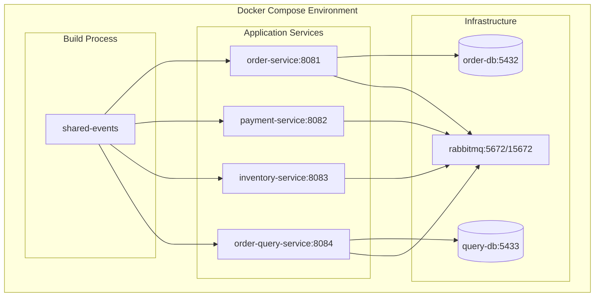
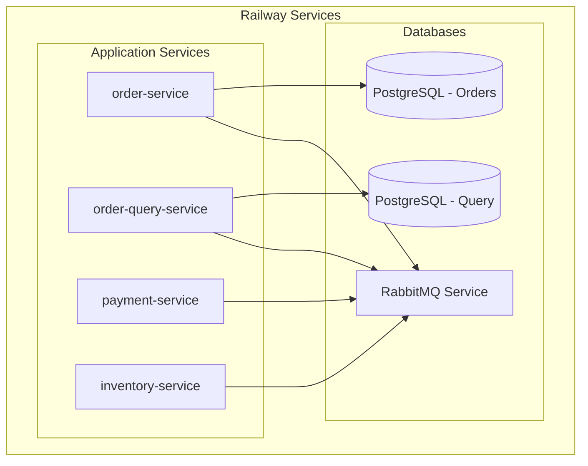

# Design Document

## Overview

Este design aborda a implementação de um sistema robusto de deployment que funciona tanto localmente quanto no Railway.app, com foco em resiliência, configuração automática e monitoramento adequado.

## Architecture

### Local Development Architecture


### Railway.app Architecture


## Components and Interfaces

### 1. Enhanced Docker Configuration

#### Multi-stage Dockerfile
```dockerfile
# Base stage for all services
FROM maven:3.9-openjdk-17-slim AS builder
WORKDIR /app
COPY pom.xml .
COPY shared-events/ ./shared-events/
RUN cd shared-events && mvn clean install

# Service-specific build
COPY services/{service-name}/ ./services/{service-name}/
RUN cd services/{service-name} && mvn clean package -DskipTests

# Runtime stage
FROM openjdk:17-jdk-slim
RUN apt-get update && apt-get install -y curl && rm -rf /var/lib/apt/lists/*
COPY --from=builder /app/services/{service-name}/target/*.jar app.jar
EXPOSE {port}
ENTRYPOINT ["java", "-jar", "/app.jar"]
```

#### Enhanced Docker Compose
- Health checks com retry inteligente
- Dependências explícitas entre serviços
- Volumes para persistência de dados
- Networks isoladas para segurança
- Configuração de recursos (CPU/Memory limits)

### 2. Railway Configuration System

#### railway.json Configuration
```json
{
  "$schema": "https://railway.app/railway.schema.json",
  "build": {
    "builder": "DOCKERFILE",
    "dockerfilePath": "services/{service}/Dockerfile"
  },
  "deploy": {
    "numReplicas": 1,
    "sleepApplication": false,
    "restartPolicyType": "ON_FAILURE"
  }
}
```

#### Environment Variable Management
- Automatic service discovery
- Database connection string generation
- RabbitMQ cluster configuration
- Service-to-service communication setup

### 3. Connection Resilience Layer

#### Database Connection Configuration
```yaml
spring:
  datasource:
    hikari:
      connection-timeout: 20000
      maximum-pool-size: 10
      minimum-idle: 5
      idle-timeout: 300000
      max-lifetime: 1200000
      leak-detection-threshold: 60000
  jpa:
    properties:
      hibernate:
        connection:
          provider_disables_autocommit: true
```

#### RabbitMQ Connection Configuration
```yaml
spring:
  rabbitmq:
    connection-timeout: 30000
    requested-heartbeat: 60
    publisher-confirm-type: correlated
    publisher-returns: true
    listener:
      simple:
        retry:
          enabled: true
          initial-interval: 1000
          max-attempts: 3
          multiplier: 2
```

### 4. Service Discovery and Health Monitoring

#### Enhanced Health Checks
- Database connectivity verification
- RabbitMQ connection status
- Dependent service availability
- Custom business logic health indicators

#### Startup Coordination
```java
@Component
public class StartupHealthCheck {
    @EventListener(ApplicationReadyEvent.class)
    public void onApplicationReady() {
        // Verify all dependencies are available
        // Log startup completion
        // Register with service discovery
    }
}
```

## Data Models

### Configuration Models
```java
@ConfigurationProperties("app.resilience")
public class ResilienceConfig {
    private int maxRetries = 3;
    private Duration initialDelay = Duration.ofSeconds(1);
    private Duration maxDelay = Duration.ofSeconds(30);
    private double backoffMultiplier = 2.0;
}

@ConfigurationProperties("app.railway")
public class RailwayConfig {
    private String environment;
    private Map<String, String> serviceUrls;
    private DatabaseConfig database;
    private RabbitMQConfig messaging;
}
```

### Health Check Models
```java
public class ServiceHealth {
    private String serviceName;
    private HealthStatus status;
    private Map<String, Object> details;
    private Instant timestamp;
}

public enum HealthStatus {
    UP, DOWN, DEGRADED, STARTING
}
```

## Error Handling

### Connection Failure Handling
1. **Exponential Backoff**: Retry com delays crescentes
2. **Circuit Breaker**: Falha rápida quando serviço está indisponível
3. **Graceful Degradation**: Funcionalidade limitada quando dependências falham
4. **Dead Letter Queue**: Mensagens não processáveis são isoladas

### Startup Failure Recovery
```java
@Component
public class StartupRecoveryManager {
    @Retryable(value = {Exception.class}, maxAttempts = 5, backoff = @Backoff(delay = 2000, multiplier = 2))
    public void initializeService() {
        // Database connection verification
        // RabbitMQ setup
        // Service registration
    }
    
    @Recover
    public void recover(Exception ex) {
        // Log failure details
        // Notify monitoring system
        // Graceful shutdown if critical
    }
}
```

## Testing Strategy

### Local Testing
1. **Docker Compose Tests**: Verificar inicialização completa
2. **Health Check Tests**: Validar todos os endpoints de saúde
3. **Integration Tests**: Testar fluxo completo de pedidos
4. **Resilience Tests**: Simular falhas de conectividade

### Railway Testing
1. **Deployment Tests**: Verificar deploy automático
2. **Environment Tests**: Validar configuração de variáveis
3. **Performance Tests**: Verificar latência e throughput
4. **Monitoring Tests**: Validar logs e métricas

### Test Automation
```bash
#!/bin/bash
# test-local-deployment.sh
echo "Starting local deployment test..."
docker-compose down -v
docker-compose up --build -d

# Wait for services to be healthy
for service in order-service payment-service inventory-service order-query-service; do
    echo "Waiting for $service to be healthy..."
    timeout 300 bash -c "until curl -f http://localhost:808${service: -1}/api/${service%-*}/health; do sleep 5; done"
done

# Run integration tests
echo "Running integration tests..."
curl -X POST http://localhost:8081/api/orders -H "Content-Type: application/json" -d '{
    "customerId": "test-customer",
    "items": [{"productId": "test-product", "productName": "Test", "quantity": 1, "price": 10.0}]
}'

echo "Local deployment test completed successfully!"
```

## Implementation Phases

### Phase 1: Local Environment Hardening
- Enhanced Docker configuration
- Robust health checks
- Connection resilience
- Comprehensive logging

### Phase 2: Railway Integration
- Railway.json configuration
- Environment variable automation
- Service deployment scripts
- Monitoring setup

### Phase 3: Testing and Validation
- Automated test suites
- Performance benchmarking
- Failure scenario testing
- Documentation updates

### Phase 4: Monitoring and Maintenance
- Log aggregation
- Metrics collection
- Alert configuration
- Maintenance procedures