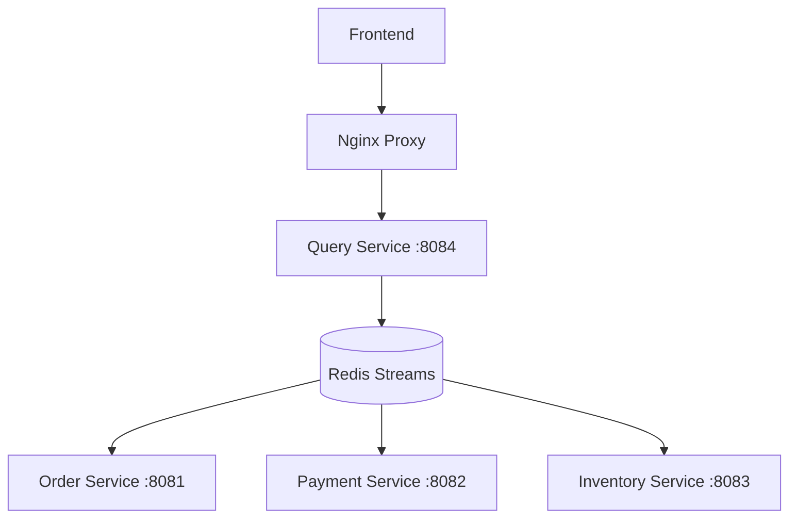
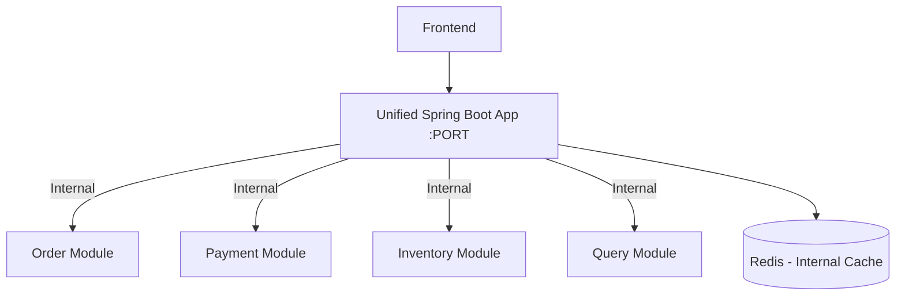

# Design Document

## Overview

Este documento apresenta o design para consolidar a arquitetura de microserviços distribuídos em uma única aplicação Spring Boot modular que pode ser deployada como um único serviço no Render.com. A solução adota o padrão de **Monólito Modular** (Modular Monolith), mantendo a separação lógica dos domínios enquanto elimina a complexidade operacional de múltiplos serviços.

## Architecture

### Arquitetura Atual vs. Arquitetura Alvo

**Atual (Microserviços Distribuídos):**


**Alvo (Monólito Modular):**


### Princípios de Design

1. **Modularidade Interna**: Manter a separação lógica através de packages Spring Boot
2. **Comunicação Síncrona**: Substituir eventos assíncronos por chamadas diretas de método
3. **Estado Unificado**: Usar Redis como cache interno, não como message broker
4. **Deploy Único**: Uma única aplicação Spring Boot deployável
5. **Fallback Resiliente**: Funcionar sem Redis se necessário

## Components and Interfaces

### Estrutura de Packages

```
com.ordersystem.unified/
├── Application.java                    # Main Spring Boot Application
├── config/                            # Configurações globais
│   ├── RedisConfig.java
│   ├── WebConfig.java
│   └── SecurityConfig.java
├── order/                             # Order Module
│   ├── OrderController.java
│   ├── OrderService.java
│   ├── OrderRepository.java
│   └── model/
│       └── Order.java
├── payment/                           # Payment Module
│   ├── PaymentService.java
│   ├── PaymentRepository.java
│   └── model/
│       └── Payment.java
├── inventory/                         # Inventory Module
│   ├── InventoryService.java
│   ├── InventoryRepository.java
│   └── model/
│       └── Inventory.java
├── query/                            # Query/Dashboard Module
│   ├── QueryController.java
│   ├── QueryService.java
│   └── dto/
│       └── OrderQueryResponse.java
└── shared/                           # Shared Components
    ├── events/                       # Event DTOs (for internal use)
    ├── exceptions/
    └── utils/
```

### Interface Definitions

#### Order Module Interface
```java
@Service
public class OrderService {
    
    @Autowired
    private PaymentService paymentService;
    
    @Autowired
    private InventoryService inventoryService;
    
    @Autowired
    private QueryService queryService;
    
    public OrderResponse createOrder(CreateOrderRequest request) {
        // 1. Validate order
        // 2. Reserve inventory (direct call)
        // 3. Process payment (direct call)
        // 4. Update query model (direct call)
        // 5. Cache in Redis (optional)
    }
}
```

#### Payment Module Interface
```java
@Service
public class PaymentService {
    
    public PaymentResult processPayment(PaymentRequest request) {
        // Synchronous payment processing
        // Return immediate result
    }
}
```

#### Inventory Module Interface
```java
@Service
public class InventoryService {
    
    public InventoryResult reserveItems(List<OrderItem> items) {
        // Synchronous inventory reservation
        // Return immediate result
    }
}
```

#### Query Module Interface
```java
@RestController
@RequestMapping("/api")
public class QueryController {
    
    @GetMapping("/orders")
    public ResponseEntity<OrderQueryResponse> getOrders() {
        // Return current state from database/cache
    }
    
    @PostMapping("/orders")
    public ResponseEntity<OrderResponse> createOrder(@RequestBody CreateOrderRequest request) {
        // Delegate to OrderService
        return orderService.createOrder(request);
    }
}
```

## Data Models

### Unified Database Schema

```sql
-- Orders table
CREATE TABLE orders (
    id VARCHAR(255) PRIMARY KEY,
    customer_id VARCHAR(255) NOT NULL,
    customer_name VARCHAR(255) NOT NULL,
    total_amount DECIMAL(10,2) NOT NULL,
    status VARCHAR(50) NOT NULL,
    created_at TIMESTAMP DEFAULT CURRENT_TIMESTAMP,
    updated_at TIMESTAMP DEFAULT CURRENT_TIMESTAMP ON UPDATE CURRENT_TIMESTAMP
);

-- Order Items table
CREATE TABLE order_items (
    id BIGINT AUTO_INCREMENT PRIMARY KEY,
    order_id VARCHAR(255) NOT NULL,
    product_id VARCHAR(255) NOT NULL,
    product_name VARCHAR(255) NOT NULL,
    quantity INTEGER NOT NULL,
    price DECIMAL(10,2) NOT NULL,
    FOREIGN KEY (order_id) REFERENCES orders(id)
);

-- Payments table
CREATE TABLE payments (
    id VARCHAR(255) PRIMARY KEY,
    order_id VARCHAR(255) NOT NULL,
    amount DECIMAL(10,2) NOT NULL,
    status VARCHAR(50) NOT NULL,
    processed_at TIMESTAMP DEFAULT CURRENT_TIMESTAMP,
    FOREIGN KEY (order_id) REFERENCES orders(id)
);

-- Inventory table
CREATE TABLE inventory (
    product_id VARCHAR(255) PRIMARY KEY,
    product_name VARCHAR(255) NOT NULL,
    available_quantity INTEGER NOT NULL,
    reserved_quantity INTEGER DEFAULT 0,
    updated_at TIMESTAMP DEFAULT CURRENT_TIMESTAMP ON UPDATE CURRENT_TIMESTAMP
);
```

### Redis Cache Structure (Optional)

```json
{
  "orders:{orderId}": {
    "id": "order-123",
    "customerId": "customer-456",
    "status": "CONFIRMED",
    "totalAmount": 100.00,
    "items": [...],
    "ttl": 3600
  },
  "inventory:{productId}": {
    "productId": "product-789",
    "availableQuantity": 50,
    "reservedQuantity": 5,
    "ttl": 1800
  }
}
```

## Error Handling

### Exception Hierarchy

```java
// Base exception
public class OrderSystemException extends RuntimeException {
    private final String errorCode;
    private final HttpStatus httpStatus;
}

// Specific exceptions
public class OrderNotFoundException extends OrderSystemException {
    public OrderNotFoundException(String orderId) {
        super("Order not found: " + orderId, "ORDER_NOT_FOUND", HttpStatus.NOT_FOUND);
    }
}

public class InsufficientInventoryException extends OrderSystemException {
    public InsufficientInventoryException(String productId) {
        super("Insufficient inventory for product: " + productId, "INSUFFICIENT_INVENTORY", HttpStatus.BAD_REQUEST);
    }
}

public class PaymentProcessingException extends OrderSystemException {
    public PaymentProcessingException(String reason) {
        super("Payment processing failed: " + reason, "PAYMENT_FAILED", HttpStatus.PAYMENT_REQUIRED);
    }
}
```

### Global Exception Handler

```java
@ControllerAdvice
public class GlobalExceptionHandler {
    
    @ExceptionHandler(OrderSystemException.class)
    public ResponseEntity<ErrorResponse> handleOrderSystemException(OrderSystemException ex) {
        return ResponseEntity
            .status(ex.getHttpStatus())
            .body(new ErrorResponse(ex.getErrorCode(), ex.getMessage()));
    }
    
    @ExceptionHandler(Exception.class)
    public ResponseEntity<ErrorResponse> handleGenericException(Exception ex) {
        return ResponseEntity
            .status(HttpStatus.INTERNAL_SERVER_ERROR)
            .body(new ErrorResponse("INTERNAL_ERROR", "An unexpected error occurred"));
    }
}
```

## Testing Strategy

### Unit Testing

```java
@ExtendWith(MockitoExtension.class)
class OrderServiceTest {
    
    @Mock
    private PaymentService paymentService;
    
    @Mock
    private InventoryService inventoryService;
    
    @InjectMocks
    private OrderService orderService;
    
    @Test
    void shouldCreateOrderSuccessfully() {
        // Given
        CreateOrderRequest request = createValidOrderRequest();
        when(inventoryService.reserveItems(any())).thenReturn(InventoryResult.success());
        when(paymentService.processPayment(any())).thenReturn(PaymentResult.success());
        
        // When
        OrderResponse response = orderService.createOrder(request);
        
        // Then
        assertThat(response.getStatus()).isEqualTo("CONFIRMED");
        verify(inventoryService).reserveItems(any());
        verify(paymentService).processPayment(any());
    }
}
```

### Integration Testing

```java
@SpringBootTest(webEnvironment = SpringBootTest.WebEnvironment.RANDOM_PORT)
@TestPropertySource(properties = {
    "spring.datasource.url=jdbc:h2:mem:testdb",
    "spring.redis.host=localhost",
    "spring.redis.port=6370" // Different port for test Redis
})
class OrderIntegrationTest {
    
    @Autowired
    private TestRestTemplate restTemplate;
    
    @Test
    void shouldCreateOrderEndToEnd() {
        // Given
        CreateOrderRequest request = createValidOrderRequest();
        
        // When
        ResponseEntity<OrderResponse> response = restTemplate.postForEntity(
            "/api/orders", request, OrderResponse.class);
        
        // Then
        assertThat(response.getStatusCode()).isEqualTo(HttpStatus.CREATED);
        assertThat(response.getBody().getStatus()).isEqualTo("CONFIRMED");
    }
}
```

### Performance Testing

```java
@Test
void shouldHandleConcurrentOrderCreation() {
    int numberOfThreads = 10;
    int ordersPerThread = 5;
    ExecutorService executor = Executors.newFixedThreadPool(numberOfThreads);
    CountDownLatch latch = new CountDownLatch(numberOfThreads);
    
    for (int i = 0; i < numberOfThreads; i++) {
        executor.submit(() -> {
            try {
                for (int j = 0; j < ordersPerThread; j++) {
                    orderService.createOrder(createValidOrderRequest());
                }
            } finally {
                latch.countDown();
            }
        });
    }
    
    assertThat(latch.await(30, TimeUnit.SECONDS)).isTrue();
}
```

## Configuration Management

### Application Properties

```yaml
# application.yml
spring:
  application:
    name: unified-order-system
  
  datasource:
    url: ${DATABASE_URL:jdbc:h2:mem:devdb}
    username: ${DB_USERNAME:sa}
    password: ${DB_PASSWORD:}
    driver-class-name: ${DB_DRIVER:org.h2.Driver}
  
  jpa:
    hibernate:
      ddl-auto: ${DDL_AUTO:update}
    show-sql: ${SHOW_SQL:false}
    properties:
      hibernate:
        dialect: ${HIBERNATE_DIALECT:org.hibernate.dialect.H2Dialect}
  
  redis:
    host: ${REDIS_HOST:localhost}
    port: ${REDIS_PORT:6379}
    password: ${REDIS_PASSWORD:}
    timeout: 2000ms
    lettuce:
      pool:
        max-active: 8
        max-idle: 8
        min-idle: 0

server:
  port: ${PORT:8080}

logging:
  level:
    com.ordersystem: ${LOG_LEVEL:INFO}
    org.springframework.web: ${WEB_LOG_LEVEL:WARN}

# Custom application properties
app:
  redis:
    enabled: ${REDIS_ENABLED:true}
    cache-ttl: ${CACHE_TTL:3600}
  
  order:
    max-items-per-order: ${MAX_ITEMS:10}
    default-timeout: ${ORDER_TIMEOUT:30000}
```

### Environment-Specific Configurations

```yaml
# application-production.yml
spring:
  datasource:
    url: ${DATABASE_URL}
    username: ${DB_USERNAME}
    password: ${DB_PASSWORD}
  
  jpa:
    hibernate:
      ddl-auto: validate
    show-sql: false

logging:
  level:
    root: WARN
    com.ordersystem: INFO

app:
  redis:
    enabled: true
    cache-ttl: 7200
```

## Deployment Architecture

### Render.com Configuration

```yaml
# render.yaml
services:
  - type: web
    name: unified-order-system
    env: java
    plan: starter
    buildCommand: ./mvnw clean package -DskipTests
    startCommand: java -Dserver.port=$PORT -jar target/unified-order-system.jar
    envVars:
      - key: SPRING_PROFILES_ACTIVE
        value: production
      - key: DATABASE_URL
        fromDatabase:
          name: order-system-db
          property: connectionString
      - key: REDIS_URL
        fromService:
          type: redis
          name: order-system-redis
          property: connectionString

databases:
  - name: order-system-db
    databaseName: order_system
    user: order_user
    plan: starter

services:
  - type: redis
    name: order-system-redis
    plan: starter
```

### Docker Configuration (Alternative)

```dockerfile
FROM openjdk:21-jre-slim

WORKDIR /app

COPY target/unified-order-system.jar app.jar

EXPOSE ${PORT:-8080}

ENTRYPOINT ["java", "-Dserver.port=${PORT:-8080}", "-jar", "app.jar"]
```

### Health Checks

```java
@Component
public class SystemHealthIndicator implements HealthIndicator {
    
    @Autowired
    private DataSource dataSource;
    
    @Autowired(required = false)
    private RedisTemplate<String, Object> redisTemplate;
    
    @Override
    public Health health() {
        Health.Builder builder = Health.up();
        
        // Check database
        try (Connection connection = dataSource.getConnection()) {
            builder.withDetail("database", "UP");
        } catch (Exception e) {
            builder.down().withDetail("database", "DOWN: " + e.getMessage());
        }
        
        // Check Redis (optional)
        if (redisTemplate != null) {
            try {
                redisTemplate.opsForValue().get("health-check");
                builder.withDetail("redis", "UP");
            } catch (Exception e) {
                builder.withDetail("redis", "DOWN: " + e.getMessage());
            }
        } else {
            builder.withDetail("redis", "DISABLED");
        }
        
        return builder.build();
    }
}
```

## Migration Strategy

### Phase 1: Code Consolidation
1. Criar nova aplicação Spring Boot unificada
2. Migrar código dos serviços para packages modulares
3. Substituir comunicação via Redis por chamadas diretas
4. Implementar testes unitários e de integração

### Phase 2: Database Consolidation
1. Criar schema unificado
2. Migrar dados dos bancos separados (se existirem)
3. Atualizar repositories para usar banco único
4. Implementar cache Redis opcional

### Phase 3: Deployment
1. Configurar Render.com com serviço único
2. Migrar variáveis de ambiente
3. Testar deploy em ambiente de staging
4. Executar deploy em produção

### Phase 4: Cleanup
1. Remover serviços antigos
2. Limpar configurações não utilizadas
3. Atualizar documentação
4. Monitorar performance e estabilidade

## Performance Considerations

### Otimizações de Performance

1. **Connection Pooling**: Configurar pool de conexões adequado
2. **Redis Caching**: Usar Redis para cache de dados frequentemente acessados
3. **Lazy Loading**: Implementar carregamento lazy para relacionamentos JPA
4. **Async Processing**: Usar @Async para operações não críticas
5. **Database Indexing**: Criar índices apropriados para queries frequentes

### Monitoring e Observability

```java
@Component
public class MetricsCollector {
    
    private final MeterRegistry meterRegistry;
    private final Counter orderCreatedCounter;
    private final Timer orderProcessingTimer;
    
    public MetricsCollector(MeterRegistry meterRegistry) {
        this.meterRegistry = meterRegistry;
        this.orderCreatedCounter = Counter.builder("orders.created")
            .description("Number of orders created")
            .register(meterRegistry);
        this.orderProcessingTimer = Timer.builder("orders.processing.time")
            .description("Order processing time")
            .register(meterRegistry);
    }
    
    public void recordOrderCreated() {
        orderCreatedCounter.increment();
    }
    
    public Timer.Sample startOrderProcessing() {
        return Timer.start(meterRegistry);
    }
}
```

Este design fornece uma base sólida para consolidar os microserviços em um monólito modular, mantendo a separação de responsabilidades enquanto simplifica significativamente a arquitetura de deployment e operação.