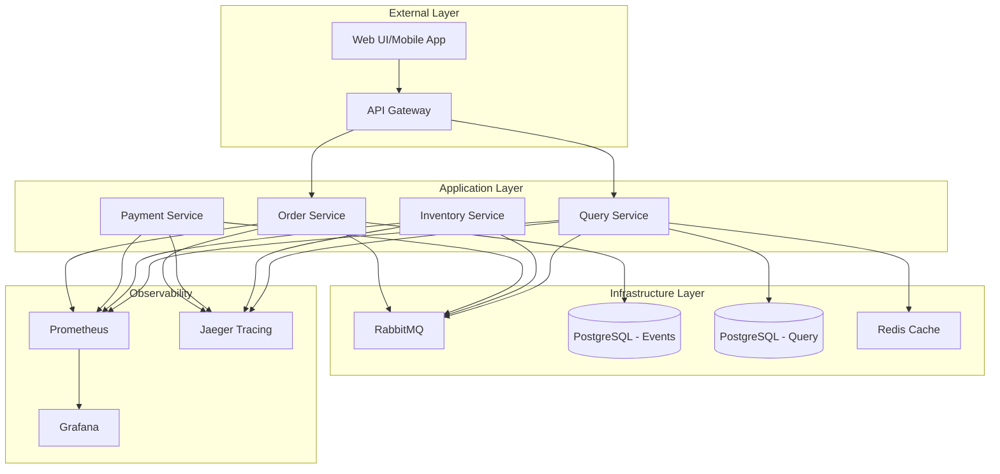
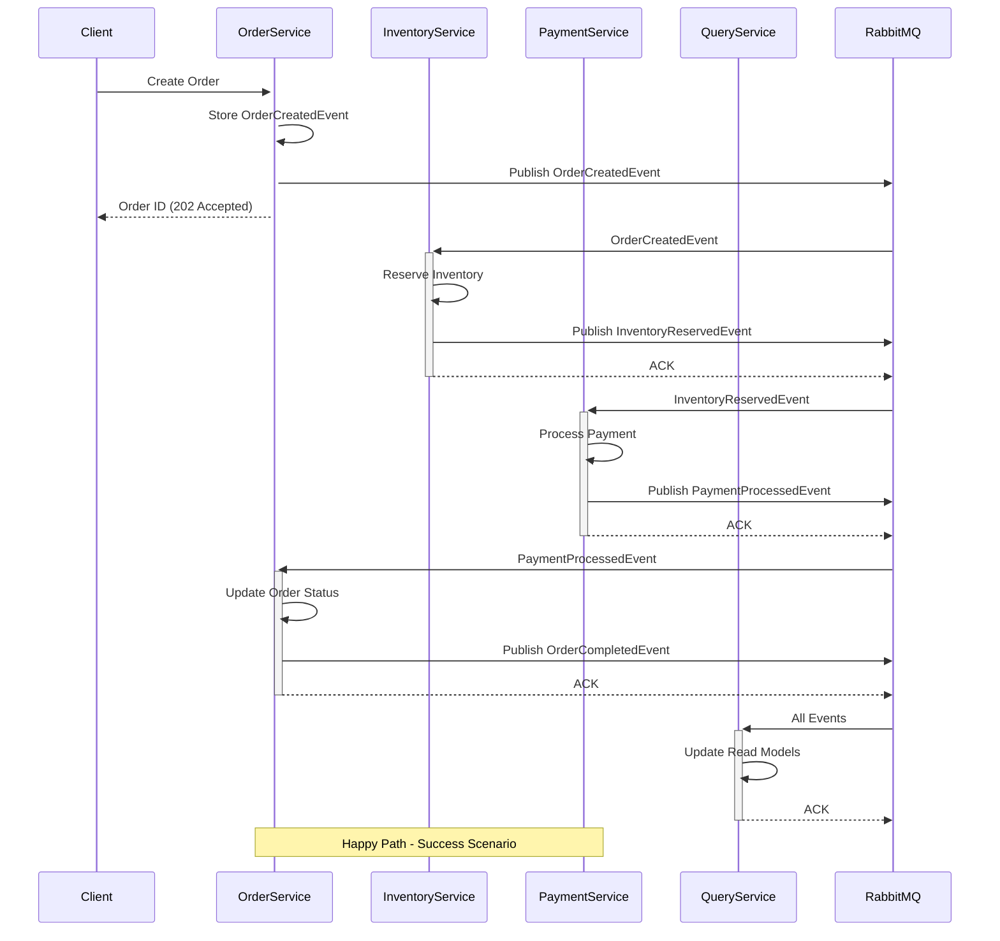
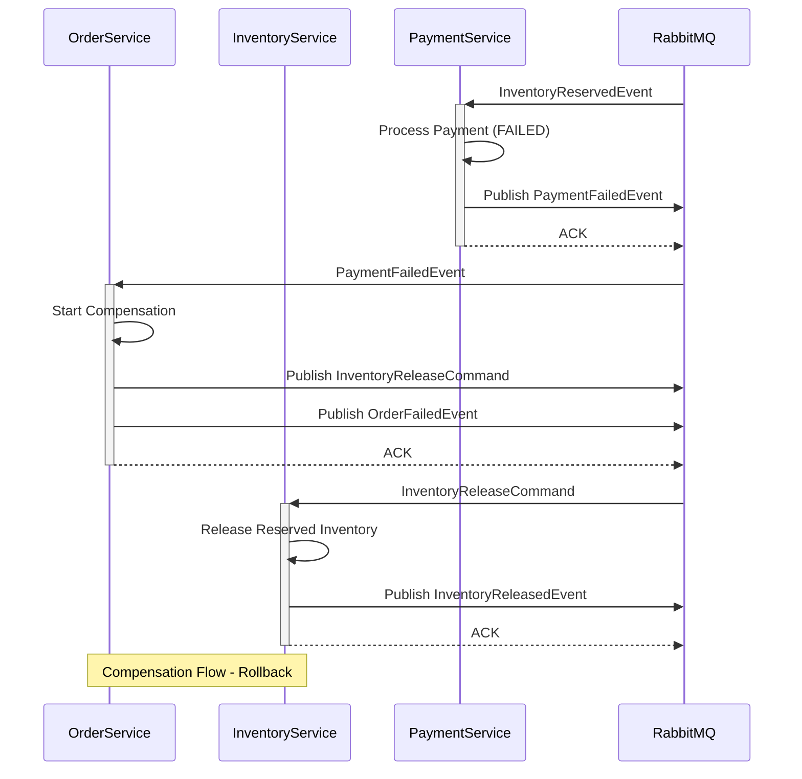

# Arquitetura do Sistema de Gestão de Pedidos Distribuído

## Visão Geral da Arquitetura

Este documento descreve a arquitetura de um sistema de gestão de pedidos baseado em microsserviços, implementando padrões avançados como Event Sourcing, CQRS e Saga Pattern.

## Diagramas de Arquitetura

### Diagrama de Alto Nível



### Fluxo de Saga (Transação Distribuída)



### Fluxo de Compensação (Saga Failure)



## Componentes da Arquitetura

### 1. Order Service (Porta 8081)
**Responsabilidades:**
- Comando e controle de pedidos
- Event Store (Event Sourcing)
- Orquestração de Sagas
- Autenticação e autorização

**Padrões Implementados:**
- Event Sourcing com PostgreSQL
- Saga Orchestration Pattern
- CQRS (Command side)
- Circuit Breaker Pattern
- JWT Authentication

**APIs Principais:**
```http
POST /api/orders - Criar pedido
GET /api/orders/{id} - Buscar pedido específico
PUT /api/orders/{id}/status - Atualizar status
DELETE /api/orders/{id} - Cancelar pedido
```

### 2. Payment Service (Porta 8082)
**Responsabilidades:**
- Processamento de pagamentos
- Validação de métodos de pagamento
- Integração com gateways externos
- Eventos de pagamento

**Padrões Implementados:**
- Event-Driven Architecture
- Retry Pattern com backoff exponencial
- Timeout Pattern
- Idempotência

**APIs Principais:**
```http
POST /api/payments/process - Processar pagamento
GET /api/payments/{orderId} - Status do pagamento
POST /api/payments/refund - Estornar pagamento
```

### 3. Inventory Service (Porta 8083)
**Responsabilidades:**
- Gestão de estoque
- Reserva e confirmação de itens
- Controle de disponibilidade
- Otimização de estoque

**Padrões Implementados:**
- Pessimistic Locking
- Event Sourcing para auditoria
- Bulkhead Pattern
- Cache-Aside Pattern

**APIs Principais:**
```http
GET /api/inventory/{productId} - Consultar estoque
POST /api/inventory/reserve - Reservar itens
POST /api/inventory/confirm - Confirmar reserva
POST /api/inventory/release - Liberar reserva
```

### 4. Order Query Service (Porta 8084)
**Responsabilidades:**
- Read Models otimizados
- Consultas complexas e relatórios
- Cache de consultas frequentes
- Projeções de eventos

**Padrões Implementados:**
- CQRS (Query side)
- Materialized Views
- Cache-First Strategy
- Event Projection

**APIs Principais:**
```http
GET /api/orders - Listar pedidos (com filtros)
GET /api/orders/customer/{id} - Pedidos por cliente
GET /api/orders/analytics - Relatórios analíticos
GET /api/orders/search - Busca textual
```

## Event Sourcing Implementation

### Event Store Schema
```sql
CREATE TABLE order_events (
    id BIGSERIAL PRIMARY KEY,
    aggregate_id VARCHAR(255) NOT NULL,
    event_type VARCHAR(255) NOT NULL,
    event_data JSONB NOT NULL,
    version INTEGER NOT NULL,
    timestamp TIMESTAMP DEFAULT CURRENT_TIMESTAMP,
    correlation_id VARCHAR(255),
    causation_id VARCHAR(255),
    
    UNIQUE(aggregate_id, version)
);

CREATE INDEX idx_order_events_aggregate_id ON order_events(aggregate_id);
CREATE INDEX idx_order_events_timestamp ON order_events(timestamp);
CREATE INDEX idx_order_events_type ON order_events(event_type);
```

### Tipos de Eventos
1. **OrderCreatedEvent** - Pedido criado
2. **OrderStatusUpdatedEvent** - Status atualizado
3. **PaymentProcessedEvent** - Pagamento processado
4. **InventoryReservedEvent** - Estoque reservado
5. **InventoryReleasedEvent** - Estoque liberado
6. **OrderCompletedEvent** - Pedido completado
7. **OrderCancelledEvent** - Pedido cancelado

## CQRS Implementation

### Command Side (Write)
- **Order Service**: Processa comandos e persiste eventos
- **Event Store**: Armazena eventos como fonte da verdade
- **Business Logic**: Validações e regras de negócio

### Query Side (Read)
- **Query Service**: Mantém read models otimizados
- **Read Database**: PostgreSQL com views materializadas
- **Cache Layer**: Redis para consultas frequentes

### Read Models
```sql
-- Tabela principal de pedidos (read model)
CREATE TABLE order_read_model (
    order_id VARCHAR(255) PRIMARY KEY,
    customer_id VARCHAR(255) NOT NULL,
    status VARCHAR(50) NOT NULL,
    total_amount DECIMAL(10,2) NOT NULL,
    created_at TIMESTAMP NOT NULL,
    updated_at TIMESTAMP NOT NULL
);

-- Itens do pedido (read model)
CREATE TABLE order_item_read_model (
    id BIGSERIAL PRIMARY KEY,
    order_id VARCHAR(255) REFERENCES order_read_model(order_id),
    product_id VARCHAR(255) NOT NULL,
    product_name VARCHAR(255) NOT NULL,
    quantity INTEGER NOT NULL,
    price DECIMAL(10,2) NOT NULL
);
```

## Saga Pattern Implementation

### Orchestration vs Choreography
**Escolha: Orchestration Pattern**

**Razões:**
- Controle centralizado do fluxo
- Facilita debugging e monitoramento
- Simplifica rollback e compensação
- Melhor para fluxos complexos

### Estados da Saga
1. **STARTED** - Saga iniciada
2. **INVENTORY_RESERVED** - Estoque reservado
3. **PAYMENT_PROCESSING** - Processando pagamento
4. **COMPLETED** - Saga completada com sucesso
5. **COMPENSATING** - Executando compensação
6. **COMPENSATED** - Compensação completada
7. **FAILED** - Saga falhou

### Timeout e Recovery
- **Timeout padrão**: 5 minutos
- **Retry automático**: 3 tentativas com backoff exponencial
- **Dead letter queue**: Para mensagens não processáveis
- **Manual intervention**: Para casos complexos

## Patterns de Resiliência

### Circuit Breaker
```yaml
resilience4j:
  circuitbreaker:
    instances:
      payment-service:
        slidingWindowSize: 10
        minimumNumberOfCalls: 5
        failureRateThreshold: 50
        waitDurationInOpenState: 5s
```

### Retry Pattern
```yaml
resilience4j:
  retry:
    instances:
      payment-service:
        maxAttempts: 3
        waitDuration: 1000ms
        enableExponentialBackoff: true
```

### Timeout Pattern
```yaml
resilience4j:
  timelimiter:
    instances:
      payment-service:
        timeoutDuration: 3s
        cancelRunningFuture: true
```

## Segurança

### Autenticação JWT
- **Token expiration**: 5 horas
- **Refresh token**: 7 dias
- **Roles**: USER, ADMIN
- **Claims**: userId, role, permissions

### Autorização
- **Method-level security**: @PreAuthorize
- **Role-based access**: RBAC
- **Resource-level**: Ownership validation

### Comunicação Segura
- **HTTPS**: TLS 1.3
- **Message encryption**: RabbitMQ with SSL
- **Database encryption**: At rest and in transit

## Observabilidade

### Distributed Tracing
- **Tool**: Jaeger
- **Sampling**: 100% em desenvolvimento, 10% em produção
- **Correlation ID**: Propagação através de todos os serviços

### Métricas
- **System metrics**: CPU, Memory, Disk, Network
- **Application metrics**: Request rate, Response time, Error rate
- **Business metrics**: Orders created, Payment success rate

### Logging
- **Format**: JSON structured logging
- **Level**: INFO em produção
- **Aggregation**: ELK Stack ou similar
- **Retention**: 30 dias

### Alerting
- **High error rate**: > 5%
- **High latency**: P95 > 2s
- **Circuit breaker open**: Immediate alert
- **Database connection**: Connection pool exhaustion

## Performance e Escalabilidade

### Benchmarks Esperados
- **Throughput**: 1000 orders/second
- **Latency**: P95 < 500ms
- **Availability**: 99.9% uptime
- **Concurrent users**: 10,000

### Estratégias de Scaling
- **Horizontal scaling**: Kubernetes HPA
- **Database scaling**: Read replicas
- **Cache strategy**: Redis cluster
- **Load balancing**: Round-robin with health checks

### Otimizações
- **Connection pooling**: HikariCP
- **Database indexing**: Optimized queries
- **Caching**: Multi-layer caching strategy
- **Asynchronous processing**: Non-blocking I/O

## Deployment e DevOps

### Containerização
```dockerfile
FROM openjdk:17-jdk-slim
COPY target/order-service-1.0.0.jar app.jar
EXPOSE 8081
ENTRYPOINT ["java", "-jar", "/app.jar"]
```

### Kubernetes Deployment
```yaml
apiVersion: apps/v1
kind: Deployment
metadata:
  name: order-service
spec:
  replicas: 3
  selector:
    matchLabels:
      app: order-service
  template:
    metadata:
      labels:
        app: order-service
    spec:
      containers:
      - name: order-service
        image: order-service:1.0.0
        ports:
        - containerPort: 8081
        env:
        - name: DATABASE_URL
          valueFrom:
            secretKeyRef:
              name: db-secret
              key: url
```

### CI/CD Pipeline
1. **Code commit** → GitHub
2. **Build** → Maven/Docker
3. **Test** → Unit + Integration
4. **Quality Gate** → SonarQube
5. **Deploy** → Kubernetes
6. **Monitor** → Prometheus/Grafana

## Considerações de Produção

### Backup e Recovery
- **Database backup**: Daily automated backups
- **Event store backup**: Continuous replication
- **Point-in-time recovery**: Available
- **Disaster recovery**: Multi-region setup

### Monitoring e Alerting
- **Infrastructure**: Prometheus + Grafana
- **Application**: Custom metrics + Jaeger
- **Business**: Custom dashboards
- **Alerting**: PagerDuty integration

### Security Hardening
- **Network policies**: Kubernetes NetworkPolicy
- **Secrets management**: Kubernetes Secrets
- **Image scanning**: Container vulnerability scanning
- **Compliance**: GDPR/PCI DSS considerations

### Capacity Planning
- **Resource allocation**: Based on load testing
- **Scaling triggers**: CPU 70%, Memory 80%
- **Database sizing**: Based on event volume
- **Storage planning**: Event store growth projection