# 🏗️ Documentação da Arquitetura

Este documento detalha a arquitetura técnica do Sistema de Gestão de Pedidos Distribuído.

## 📊 Visão Geral da Arquitetura

```mermaid
graph TB
    %% Frontend Layer
    UI[🎨 Frontend SPA<br/>HTML5 + CSS3 + JS]
    
    %% API Gateway / Proxy Layer  
    NGINX[🔀 Nginx Reverse Proxy<br/>Load Balancer + Health Checks]
    
    %% Query Service (CQRS Read Side)
    QS[🔍 Query Service<br/>Port 8084<br/>Read Model + Dashboard]
    
    %% Event Store
    REDIS[(🗃️ Redis Streams<br/>Event Store<br/>Message Broker)]
    
    %% Command Services (CQRS Write Side)
    OS[📦 Order Service<br/>Port 8081<br/>Command Handler]
    PS[💳 Payment Service<br/>Port 8082<br/>Command Handler] 
    IS[📊 Inventory Service<br/>Port 8083<br/>Command Handler]
    
    %% User Interactions
    USER[👤 User] --> UI
    UI --> NGINX
    
    %% Nginx Routes
    NGINX --> |/health| QS
    NGINX --> |/api/*| QS
    NGINX --> |/| UI
    
    %% Event Sourcing Flow
    QS --> |Commands| REDIS
    REDIS --> |Events| OS
    REDIS --> |Events| PS  
    REDIS --> |Events| IS
    
    %% Event Publishing
    OS --> |OrderCreated<br/>OrderConfirmed| REDIS
    PS --> |PaymentProcessed<br/>PaymentFailed| REDIS
    IS --> |InventoryReserved<br/>StockUpdated| REDIS
    
    %% Read Model Updates
    REDIS --> |Event Projection| QS
```



## 🎯 Padrões Arquiteturais

### 1. Event Sourcing
- **Event Store**: Redis Streams armazena todos os eventos do sistema
- **Immutable Events**: Histórico completo de mudanças de estado
- **Event Replay**: Capacidade de reconstruir o estado atual a partir dos eventos

### 2. CQRS (Command Query Responsibility Segregation)
- **Command Side**: Order, Payment, Inventory Services (Write)
- **Query Side**: Query Service (Read)
- **Separation**: Otimização independente para leitura e escrita

### 3. Microservices
- **Domain-Driven Design**: Cada serviço representa um bounded context
- **Independent Deployment**: Deploy e escalonamento independente
- **Technology Diversity**: Diferentes tecnologias por serviço se necessário

### 4. Eventual Consistency
- **Asynchronous Processing**: Comunicação via events
- **BASE Properties**: Basically Available, Soft state, Eventual consistency
- **Event Ordering**: Order garantido por Redis Streams

## 🔧 Componentes Técnicos

### Frontend (Client Layer)

```javascript
// Tecnologias
- HTML5 + CSS3 + Vanilla JavaScript
- Glassmorphism Design System
- Responsive Grid Layout
- Real-time Updates (Polling)

// Funcionalidades
- Dashboard com métricas
- Formulário de criação de pedidos
- Lista de pedidos em tempo real
- Health check system status
- Auto-refresh a cada 30s
```

### API Gateway / Proxy Layer

```nginx
# Nginx Configuration
server {
    listen $PORT;
    
    # Static Frontend
    location / {
        root /app/frontend;
        try_files $uri $uri/ /index.html;
    }
    
    # API Proxy to Query Service
    location /api/ {
        proxy_pass http://localhost:8084/api/;
        # Rate limiting + CORS + Fallbacks
    }
    
    # Health Check with Fallback
    location /health {
        proxy_pass http://localhost:8084/health;
        error_page 502 503 504 = @health_fallback;
    }
}
```

### Query Service (Read Model)

```java
@RestController
@RequestMapping("/api")
public class OrderQueryController {
    
    // Read Operations
    @GetMapping("/orders")
    public ResponseEntity<OrderQueryResponse> getOrders() {
        // Return aggregated view of orders
    }
    
    // Write Operations (Demo Mode)
    @PostMapping("/orders") 
    public ResponseEntity<OrderResponse> createOrder(@RequestBody CreateOrderRequest request) {
        // Publish command to event stream
        // Return immediate response
    }
    
    // Health Check
    @GetMapping("/health")
    public Map<String, String> health() {
        return Map.of("status", "UP", "service", "query-service");
    }
}
```

### Event Store (Redis Streams)

```redis
# Event Stream Structure
STREAM: order-events
- 1234567890123-0: {type: "OrderCreated", orderId: "123", customerName: "João", ...}
- 1234567890124-0: {type: "InventoryReserved", orderId: "123", productId: "456", ...}
- 1234567890125-0: {type: "PaymentProcessed", orderId: "123", amount: 100.00, ...}

STREAM: payment-events  
- Events relacionados a pagamentos

STREAM: inventory-events
- Events relacionados ao estoque
```

### Command Services (Write Model)

```java
// Order Service (Port 8081)
@Service
public class OrderCommandService {
    
    public void handleCreateOrder(CreateOrderCommand command) {
        // 1. Validate command
        // 2. Create order aggregate  
        // 3. Publish OrderCreated event
        // 4. Trigger inventory reservation
    }
    
    @EventHandler
    public void on(PaymentProcessedEvent event) {
        // Update order status to confirmed
        // Publish OrderConfirmed event
    }
}

// Payment Service (Port 8082)
@Service
public class PaymentCommandService {
    
    @EventHandler  
    public void on(OrderCreatedEvent event) {
        // Process payment asynchronously
        // Publish PaymentProcessed or PaymentFailed
    }
}

// Inventory Service (Port 8083)
@Service
public class InventoryCommandService {
    
    @EventHandler
    public void on(OrderCreatedEvent event) {
        // Reserve inventory
        // Publish InventoryReserved or InventoryUnavailable  
    }
}
```

## 🚀 Deploy Architecture (Render.com)

### Container Strategy

```dockerfile
# Multi-stage Build
FROM maven:3.9-openjdk-21 as shared-events
# Build shared events library

FROM maven:3.9-openjdk-21 as java-builder  
COPY --from=shared-events /app/target/*.jar /root/.m2/repository/
# Build all Java services

FROM node:18-alpine as frontend-builder
# Build static frontend

FROM openjdk:21-jre-slim as runtime
# Copy all artifacts
# Setup supervisord
# Configure nginx template
```

### Service Distribution

```yaml
# Web Service (Public)
gestao-de-pedidos.onrender.com:
  - Nginx (Port ${PORT})
  - Frontend (Static Files)  
  - Query Service (Port 8084)
  - Memory: 512MB
  - CPU: 0.5 cores

# Background Workers (Private)
order-service-worker:
  - Order Service (Port 8081)
  - Memory: 512MB
  
payment-service-worker:
  - Payment Service (Port 8082)  
  - Memory: 512MB
  
inventory-service-worker:
  - Inventory Service (Port 8083)
  - Memory: 512MB

# Redis Service  
order-system-redis:
  - Event Store
  - Message Broker
  - Memory: 25MB (Free Tier)
```

### Service Discovery & Configuration

```bash
# Environment-based Service Detection
SERVICE_TYPE=${SERVICE_TYPE:-${RENDER_SERVICE_TYPE:-web}}

# Dynamic Configuration
case $SERVICE_TYPE in
  "web")
    # Start Nginx + Query Service
    envsubst < nginx.conf.template > nginx.conf
    supervisord -c web.conf
    ;;
  "order"|"payment"|"inventory")  
    # Start specific microservice
    supervisord -c ${SERVICE_TYPE}.conf
    ;;
esac
```

## 🔄 Event Flow Examples

### Fluxo de Criação de Pedido


## 🔧 Configuration Management

### Environment Variables

```bash
# Service Detection
SERVICE_TYPE=web|order|payment|inventory

# Redis Configuration  
REDIS_URL=redis://order-system-redis:6379

# Port Configuration (Render)
PORT=10000  # Dynamic from Render

# JVM Memory Tuning
JAVA_OPTS=-Xmx128m -XX:+UseContainerSupport -XX:MaxRAMPercentage=75.0

# Spring Profiles
SPRING_PROFILES_ACTIVE=production
```

### Supervisord Configuration

```ini
# web.conf - Query Service + Nginx
[program:query-service]
command=java -Xmx128m -jar /app/services/query-service.jar --server.port=8084
autostart=true
autorestart=true

[program:nginx]
command=nginx -g "daemon off;"
autostart=true
autorestart=true
depends_on=query-service

# order.conf - Order Service Only
[program:order-service]  
command=java -Xmx128m -jar /app/services/order-service.jar --server.port=8081
autostart=true
autorestart=true
```

## 📊 Monitoring & Observability

### Health Checks

```java
// Application Health
@Component
public class CustomHealthIndicator implements HealthIndicator {
    
    @Override
    public Health health() {
        // Check Redis connectivity
        // Check memory usage
        // Check event processing lag
        return Health.up()
            .withDetail("service", "order-service")
            .withDetail("events-processed", getEventsProcessed())
            .build();
    }
}
```

### Metrics & Logging

```yaml
# Application Metrics
- Response Time: < 100ms (average)
- Memory Usage: < 400MB per service  
- Event Processing: < 1s latency
- Throughput: 50+ req/sec

# System Monitoring
- Health Check: /health (30s interval)
- Auto-restart: On failure  
- Circuit Breaker: On downstream failures
- Graceful Shutdown: 10s timeout
```

## 🚦 Failure Scenarios & Resilience

### Circuit Breaker Pattern

```java
@Component
public class PaymentServiceClient {
    
    @CircuitBreaker(name = "payment-service", fallbackMethod = "fallbackPayment")
    @Retry(name = "payment-service")
    @TimeLimiter(name = "payment-service")
    public CompletableFuture<PaymentResult> processPayment(PaymentRequest request) {
        // Call payment processing
    }
    
    public CompletableFuture<PaymentResult> fallbackPayment(PaymentRequest request, Exception ex) {
        // Return cached result or default response
        return CompletableFuture.completedFuture(PaymentResult.pending());
    }
}
```

### Event Replay & Recovery

```java  
@Service
public class EventRecoveryService {
    
    public void rebuildProjections() {
        // Read all events from Redis Streams
        // Replay events to rebuild read models
        // Useful for recovery or new projections
    }
    
    public void reprocessFailedEvents() {
        // Handle dead letter queue
        // Retry failed event processing
    }
}
```

## 🔒 Security Considerations

### API Security

```nginx
# Rate Limiting
limit_req_zone $binary_remote_addr zone=api:10m rate=10r/s;
limit_req_zone $binary_remote_addr zone=general:10m rate=30r/s;

# Security Headers
add_header X-Frame-Options "SAMEORIGIN" always;
add_header X-XSS-Protection "1; mode=block" always;
add_header X-Content-Type-Options "nosniff" always;
add_header Referrer-Policy "no-referrer-when-downgrade" always;
add_header Content-Security-Policy "default-src 'self'" always;

# CORS Configuration
add_header Access-Control-Allow-Origin "*" always;
add_header Access-Control-Allow-Methods "GET, POST, PUT, DELETE, OPTIONS" always;
```

### Event Security

```java
// Event Integrity
public class SecureEvent {
    private String eventId;
    private String aggregateId;
    private String eventType;
    private Object data;
    private Instant timestamp;
    private String checksum; // For integrity verification
    
    // Digital signature for critical events
    private String signature;
}
```

---

## 📈 Performance Characteristics

### Latency Targets
- **API Response**: < 100ms (95th percentile)
- **Event Processing**: < 1s (average)
- **UI Load**: < 1.5s (First Contentful Paint)
- **Health Check**: < 500ms

### Throughput Capacity
- **Orders/minute**: 100+ (current capacity)
- **Events/second**: 1000+ (Redis capability)
- **Concurrent Users**: 50+ (with current resources)

### Resource Utilization  
- **Memory**: ~60% of allocated (400MB/512MB)
- **CPU**: ~30% average usage
- **Network**: < 10MB/s typical
- **Storage**: Minimal (stateless services)

Esta arquitetura fornece um sistema robusto, escalável e observável, seguindo as melhores práticas de microservices e event sourcing.