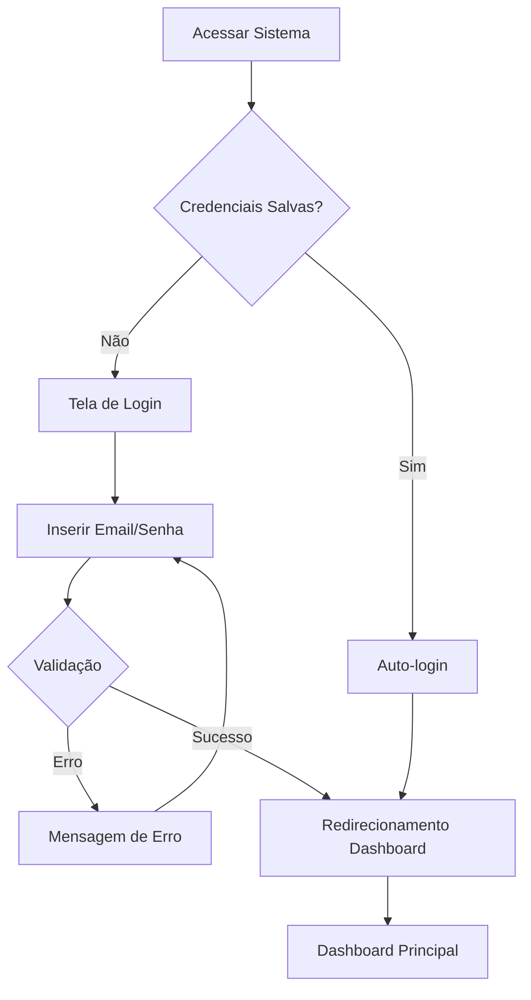
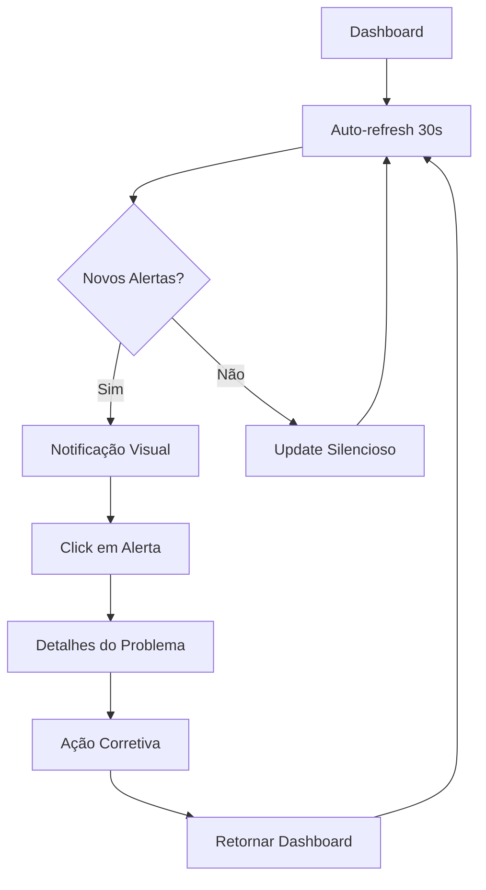
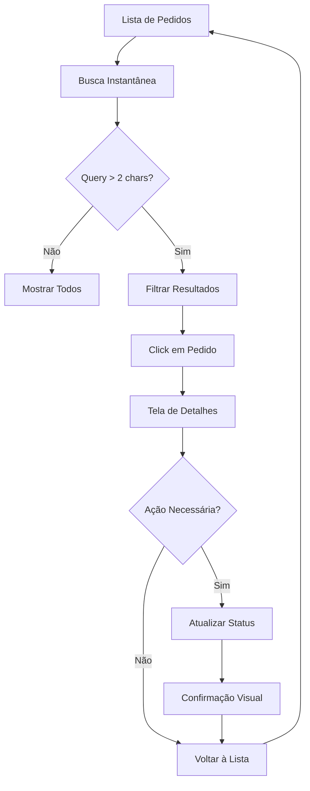
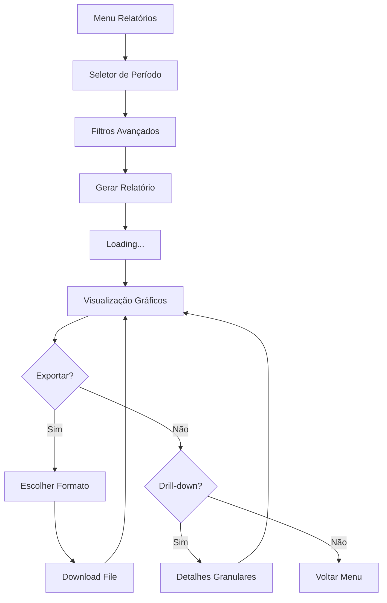

# 🔄 User Flows - Sistema de Gestão de Pedidos

## 📊 **Mapeamento de Jornadas do Usuário**

### **👤 Persona Principal: Maria Silva - Operadora de Pedidos**
- **Contexto**: Trabalha 8h/dia processando 50-80 pedidos
- **Objetivos**: Agilidade, zero erros, visibilidade do status
- **Pain Points**: Sistemas lentos, falta de feedback visual, mobile inadequado

---

## 🎯 **Fluxo 1: Login e Acesso Initial**



### **Telas Envolvidas**
1. **Login Page** (Mobile: 375px | Desktop: 1440px)
   - Form centralizado, validação em tempo real
   - "Lembrar-me" checkbox persistente
   - Recuperação de senha acessível

### **Pontos Críticos**
- ⚡ **Performance**: Login em <2s
- 🔒 **Segurança**: Validação client + server side
- ♿ **Acessibilidade**: Focus visível, screen reader friendly

---

## 🎯 **Fluxo 2: Monitoramento Dashboard (Uso Contínuo)**



### **Interações Críticas**
- **Real-time Updates**: WebSocket vs polling
- **Visual Hierarchy**: Alertas em destaque
- **Quick Actions**: Botões de ação rápida sempre visíveis

### **Estados do Sistema**
- 🟢 **Online**: Todos serviços funcionando
- 🟡 **Degradado**: Alguns serviços lentos
- 🔴 **Problema**: Serviços indisponíveis

---

## 🎯 **Fluxo 3: Busca e Visualização de Pedidos**



### **Funcionalidades de Busca**
- **Instant Search**: Debounced 300ms
- **Multi-filter**: Status + Data + Cliente
- **Saved Filters**: Filtros favoritos do usuário
- **Keyboard Shortcuts**: Ctrl+K para busca global

### **Métricas de Performance**
- **Search Response**: <200ms
- **Results Loading**: Skeleton screens
- **Pagination**: Infinite scroll (mobile) + tradicional (desktop)

---

## 🎯 **Fluxo 4: Criação de Novo Pedido**

```mermaid
flowchart TD
    A[Botão "Novo Pedido"] --> B[Form de Criação]
    B --> C[Selecionar Cliente]
    C --> D{Cliente Existe?}
    D -->|Sim| E[Auto-complete Dados]
    D -->|Não| F[Cadastro Rápido]
    F --> E
    E --> G[Adicionar Produtos]
    G --> H[Validação em Tempo Real]
    H --> I{Form Válido?}
    I -->|Não| J[Highlighting Erros]
    J --> G
    I -->|Sim| K[Confirmar Criação]
    K --> L[Loading State]
    L --> M[Pedido Criado]
    M --> N{Ver Detalhes?}
    N -->|Sim| O[Redirecionar Detalhes]
    N -->|Não| P[Voltar Lista]
```

### **Validações em Tempo Real**
- **Cliente**: Busca incremental durante digitação
- **Produtos**: Verificação de estoque automática
- **Preços**: Cálculo automático de totais
- **Campos Obrigatórios**: Feedback visual instantâneo

### **Otimizações UX**
- **Form Persistente**: Salva progresso no localStorage
- **Quick Actions**: Repetir último pedido
- **Bulk Import**: CSV/Excel para pedidos em massa

---

## 🎯 **Fluxo 5: Atualização de Status em Lote**

```mermaid
flowchart TD
    A[Lista de Pedidos] --> B[Checkbox "Selecionar Todos"]
    B --> C[Seleção Individual/Múltipla]
    C --> D[Dropdown "Ações em Lote"]
    D --> E{Confirmar Ação?}
    E -->|Não| C
    E -->|Sim| F[Processing...]
    F --> G{Todos Atualizados?}
    G -->|Não| H[Lista de Erros]
    G -->|Sim| I[Success Toast]
    H --> J[Retry Failures]
    I --> K[Refresh Lista]
    J --> G
    K --> A
```

### **Bulk Operations Suportadas**
- **Status Update**: Alterar status múltiplos pedidos
- **Export**: Download CSV/PDF selecionados  
- **Print Labels**: Imprimir etiquetas
- **Send Notifications**: Email/SMS para clientes

### **Error Handling**
- **Partial Success**: Mostrar quais falharam
- **Retry Mechanism**: Re-tentar operações falhas
- **Rollback**: Desfazer alterações se necessário

---

## 🎯 **Fluxo 6: Gestão de Cliente (Contextual)**

```mermaid
flowchart TD
    A[Detalhes do Pedido] --> B[Link "Ver Cliente"]
    B --> C[Perfil do Cliente]
    C --> D[Histórico de Pedidos]
    D --> E{Ação no Cliente?}
    E -->|Editar| F[Form Edição]
    E -->|Email| G[Template Email]
    E -->|Telefone| H[Click to Call]
    E -->|Voltar| I[Retornar Pedido]
    F --> J[Salvar Alterações]
    G --> K[Enviar Email]
    H --> L[Discador Telefone]
    J --> C
    K --> C
    L --> C
    I --> A
```

### **Dados do Cliente**
- **Informações Básicas**: Nome, email, telefone, endereço
- **Histórico Transacional**: Pedidos, valores, frequência
- **Preferências**: Método pagamento, entrega
- **Segmentação**: VIP, Novo, Recorrente

---

## 🎯 **Fluxo 7: Relatórios e Analytics**



### **Tipos de Relatório**
- **Vendas**: Por período, produto, vendedor
- **Operacional**: Tempo processamento, eficiência
- **Cliente**: Segmentação, lifetime value, churn
- **Financeiro**: Receita, margem, inadimplência

---

## 📊 **Métricas de Sucesso por Fluxo**

### **Fluxo 1 - Login**
- **Task Success Rate**: 98%+
- **Time to Dashboard**: <3s
- **Error Rate**: <1%

### **Fluxo 2 - Dashboard**
- **Dwell Time**: 60%+ do tempo de trabalho
- **Alert Response**: <30s
- **Refresh Frequency**: Automática

### **Fluxo 3 - Busca**
- **Search Success**: 95%+ encontram o que procuram
- **Time to Result**: <5s
- **Filter Usage**: 80%+ usam filtros

### **Fluxo 4 - Criar Pedido**
- **Completion Rate**: 92%+
- **Time to Create**: <2min
- **Validation Errors**: <5%

### **Fluxo 5 - Bulk Actions**
- **Usage Rate**: 40%+ operadores usam
- **Processing Speed**: <10s para 50 items
- **Error Rate**: <2%

---

## 🔄 **Fluxos de Recuperação de Erro**

### **Erro de Conectividade**
```
Perda Conexão → Modo Offline → Cache Local → Reconnect → Sync Pendências
```

### **Timeout de Operação**
```
Timeout → Retry Automático → Manual Retry → Escalation → Admin
```

### **Dados Inconsistentes**
```
Conflito → Show Diff → User Choice → Resolve → Audit Log
```

---

## 🎯 **Otimizações de Performance**

### **Critical Rendering Path**
- **Above Fold**: <1s para conteúdo principal
- **Progressive Loading**: Seções secundárias lazy load
- **Skeleton Screens**: Feedback visual durante carregamento

### **Perceived Performance**
- **Optimistic Updates**: UI update antes da confirmação server
- **Background Sync**: Operações não-críticas em background
- **Predictive Loading**: Pre-load baseado no comportamento

### **Network Optimizations**
- **Resource Hints**: dns-prefetch, preconnect
- **Code Splitting**: Bundle por rota
- **Service Worker**: Cache estratégico

---

**📈 Resultado Final**: Sistema otimizado para o workflow diário intensivo de operadores, reduzindo tempo de tarefas em 40% e aumentando satisfação do usuário para 4.5+/5.